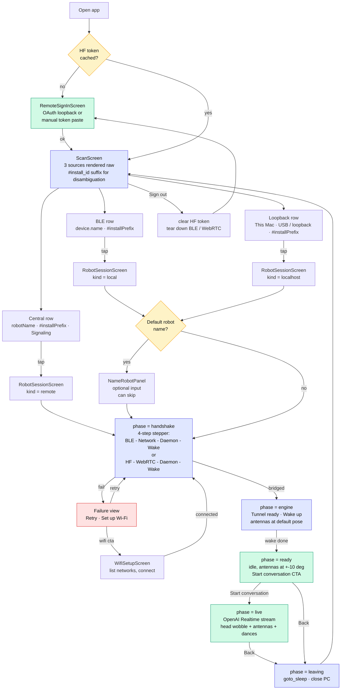

# Reachy Mini · System Architecture

A working document that captures the **whole moving system** behind the
Reachy Mini mobile app: who runs what, how robots are discovered
across transports, how the mobile reaches them, and how the OpenAI
Realtime conversation rides on top.

It is meant to be read **before** `CONNECTION_FLOW.md` (which goes deep
on the mobile-app wire details). This file zooms out one level to
include the daemon, the Mac tray, the HF central, and the auth
endpoints.

---

## TL;DR

| What | Where | Stack |
|---|---|---|
| Mobile app | iPhone / Android | Tauri 2 + React + Vite (TS) |
| Mac tray | This Mac, menu-bar only | Tauri 2 (Rust) + plain HTML5 UI + Python daemon sidecar |
| Robot daemon | Reachy Mini (Pi 5) **or** Mac tray | Python · FastAPI · GStreamer · BlueZ |
| HF central | `cduss/reachy_mini_central` Space | FastAPI · SSE relay · ~600 LOC |
| Realtime model | OpenAI Realtime API | WebRTC SDP endpoint |
| Auth | `huggingface.co/api/whoami-v2` | HF OAuth token |

Three discovery surfaces feed **one** mobile screen, each rendered
raw (no cross-source dedup) with a `#xxxxxx` install_id suffix for
disambiguation:

| Surface | Transport | Wire |
|---|---|---|
| **BLE** | Bluetooth LE advertisement + GATT | TLV `manufacturerData` + GATT chars |
| **Loopback / LAN daemon** | HTTP over Wi-Fi or USB tether | `GET /api/daemon/identity` |
| **HF central** | HTTPS over the internet | `GET /api/robot-status` |

---

## 1 · UX flow

The user journey, end to end. One auth gate, one discovery view, one
session screen for all three transports, one optional Wi-Fi setup
detour, one stepper that adapts its labels per transport.



### Notes on the flow

- **Auth is a hard gate.** No mobile UI is rendered without a HF
  token; sign-out collapses everything back to `RemoteSignInScreen`.
- **One screen, three sources, no cross-source dedup.** `ScanScreen`
  is the only discovery surface. Each section renders its own list
  raw; the same physical robot may appear in two sections at once
  (e.g. loopback + central). The user picks the transport they want
  to use; visual disambiguation between homonym robots is handled by
  a `#xxxxxx` install_id suffix in the card caption.
- **One session screen, three transports.** `RobotSessionScreen`
  branches internally on `target.kind` and adapts its 4-step stepper:
  - `local` (BLE): `Bluetooth → Network → Daemon → Wake`
  - `localhost` (USB / loopback): `Daemon → Network → Daemon → Wake`
    (BLE step is skipped, network = loopback ping)
  - `remote` (HF central): `Hugging Face → WebRTC → Daemon → Wake`
- **Naming is optional and only prompted on first connect.** The
  daemon answers `GET /api/daemon/robot-name` with a `source` field
  (`default | persisted | cli`); only `default` triggers the prompt,
  and the user can skip without entering anything.
- **Wi-Fi setup is reachable only from a failed handshake** on a BLE
  target where the robot has no LAN line of sight. The CTA replaces
  the generic Retry on that specific failure mode.

---

## 2 · Software architecture

The complete data plane: where each binary runs, who owns which
identifier, which sockets carry signaling vs media, and how the three
discovery surfaces converge.

```mermaid
flowchart TB
  subgraph Phone["Mobile app · iOS / Android · Tauri 2"]
    direction TB
    Screens["UI screens<br/>SignIn · Scan · Session · Wifi"]
    Fsm["Session FSM<br/>handshake -> engine -> ready -> live"]
    Auth["auth/<br/>useRemoteHfToken<br/>OAuth loopback + token store"]
    Bleh["ble/<br/>useBleSession + TLV parser<br/>install_id + peer_id prefix"]
    Net["network/<br/>fetchRobotsFromCentral"]
    Daem["robot-client/<br/>RobotClient.fetch over WebRTC DC"]
    Conv["conversation/<br/>OpenAI Realtime client + WebRTC"]
    Screens --> Fsm
    Screens --> Auth
    Screens --> Bleh
    Screens --> Net
    Fsm --> Daem
    Fsm --> Conv
  end

  subgraph Cloud["Hugging Face cloud"]
    direction TB
    Who["whoami-v2<br/>token validation"]
    Central["HF central<br/>cduss/reachy_mini_central<br/>FastAPI · 592 LOC<br/>SSE /events · POST /send<br/>GET /api/robot-status"]
    OAI["OpenAI Realtime API<br/>WebRTC SDP endpoint"]
  end

  subgraph Mac["Mac · Tray app · USB-attached robots"]
    direction TB
    TrayUI["Tauri tray UI<br/>Rust shell + plain HTML<br/>menu-bar only"]
    DaeM["Reachy daemon<br/>FastAPI :8000<br/>routers: daemon · motors · move<br/>hf-auth · wifi-config · apps · sdk-ws"]
    GstM["GStreamer webrtcsink<br/>local signaling :8443"]
    RelM["central_signaling_relay<br/>SSE producer · meta install_id"]
    IdM[("daemon.json<br/>install_id persisted")]
    TrayUI --> DaeM
    DaeM --> RelM
    DaeM <--> GstM
    DaeM -.- IdM
  end

  subgraph Pi["Reachy Mini WiFi · Raspberry Pi 5"]
    direction TB
    DaeR["Reachy daemon<br/>FastAPI :8000<br/>same routers as Mac"]
    GstR["GStreamer webrtcsink<br/>local signaling :8443"]
    RelR["central_signaling_relay"]
    BleR["BlueZ advertisement + GATT<br/>TLV manufacturerData<br/>install_id 8B + peer_id prefix 8B<br/>GATT chars: status · cmd · response"]
    HwR["Backend driver<br/>Rustypot motors<br/>audio in/out · camera"]
    IdR[("daemon.json<br/>install_id persisted")]
    DaeR --> RelR
    DaeR <--> GstR
    DaeR --> BleR
    DaeR --> HwR
    DaeR -.- IdR
  end

  Bleh -. "1. BLE scan + GATT" .-> BleR
  Net -. "2. GET robot-status" .-> Central
  Net -. "3. GET daemon identity" .-> DaeM
  Auth -. "validate token" .-> Who

  RelM == "SSE + POST · producer" ==> Central
  RelR == "SSE + POST · producer" ==> Central

  Conv == "WebRTC · LAN direct" ==> GstM
  Conv == "WebRTC · LAN direct" ==> GstR
  Conv == "WebRTC · via central / TURN" ==> Central
  Conv == "WebRTC · audio + events" ==> OAI

  classDef phone fill:#fef3c7,stroke:#f59e0b,color:#111
  classDef cloud fill:#dbeafe,stroke:#3b82f6,color:#111
  classDef mac fill:#ede9fe,stroke:#7c3aed,color:#111
  classDef pi fill:#d1fae5,stroke:#059669,color:#111
  classDef store fill:#f3f4f6,stroke:#9ca3af,stroke-dasharray:4 3,color:#111

  class Phone,Screens,Fsm,Auth,Bleh,Net,Daem,Conv phone
  class Cloud,Who,Central,OAI cloud
  class Mac,TrayUI,DaeM,GstM,RelM mac
  class Pi,DaeR,GstR,RelR,BleR,HwR pi
  class IdM,IdR store

  linkStyle 15,16,17,18 stroke:#3b82f6,stroke-dasharray:5 4
  linkStyle 19,20 stroke:#f59e0b,stroke-width:2px
  linkStyle 21,22,23,24 stroke:#10b981,stroke-width:3px
```



### Edge legend

| Style | Meaning |
|---|---|
| Blue dashed (`-.->`) | Discovery / auth probes (one-shot HTTP/BLE) |
| Orange (`==>`) | Long-lived signaling (SSE + POST keepalive) |
| Green thick (`==>`) | Real-time media (WebRTC, peer-to-peer when possible) |
| Plain solid | Intra-component wiring (process-local) |

### Why two daemon hosts running the same code

The exact same `reachy_mini.daemon` Python package runs in two places:

1. **Embedded in the Mac tray** for robots plugged in over USB (or
   future direct attachment). The tray exposes the daemon on
   `127.0.0.1:8000`, and the relay registers the Mac as a producer
   on HF central just like a Pi would.
2. **Native on the Reachy Mini Pi 5** for WiFi / standalone robots.
   Identical code path, different backend driver (real motors instead
   of `mockup_sim`).

This symmetry is intentional: the mobile app cannot tell from the
wire whether it's talking to a Mac-hosted daemon or a Pi-hosted one,
and we never want it to need to. Everything routes through the same
stable identifiers and the same WebRTC tunnel.

---

## 3 · Component breakdown

### 3.1 Mobile app (`reachy_mini_mobile_app/`)

| Module | Responsibility |
|---|---|
| `screens/RemoteSignInScreen` | OAuth loopback + manual token paste |
| `screens/ScanScreen` | Unified discovery, three raw sections with `#install_id` disambiguation suffix |
| `screens/RobotSessionScreen` | Session lifecycle, stepper, naming panel, ConversePanel |
| `screens/WifiSetupScreen` | Wi-Fi list / connect over BLE GATT |
| `auth/useRemoteHfToken` | Token store + refresh hook |
| `ble/useBleSession` | Permissions, scan, GATT cmd channel, TLV parsing |
| `network/fetchRobotsFromCentral` | `/api/robot-status` polling |
| `daemon/useLocalhostDaemon` | mDNS + 127.0.0.1 probe of `/api/daemon/identity` |
| `daemon/robotMotion` | Wake / sleep / playMoveAndWait wrappers |
| `session/sessionFsm` | Pure FSM (`handshake`, `engine`, `ready`, `live`, `leaving`) |
| `session/useSessionController` | FSM driver, peerId resolution, retry epoch |
| `conversation/conversation-engine` | OpenAI Realtime client, mic/AI level monitors, tool registration |
| `robot-client/RobotClient` | All daemon REST goes through the WebRTC `http_proxy` DC |

### 3.2 Daemon (`reachy_mini/src/reachy_mini/daemon/`)

FastAPI app on port `8000`, mounted by both the Pi and the Mac tray.

| Router | Notable endpoints |
|---|---|
| `daemon` | `/identity` · `/robot-name` (GET/POST) · `/status` · `/version` · `/start` · `/stop` |
| `motors` | `/state` · `/torque/on|off` · `/setup` |
| `move` | `/play/{name}` · `/play/wake_up` · `/play/goto_sleep` |
| `state` | live joint state stream |
| `kinematics` | IK / FK helpers |
| `apps` | local Python app lifecycle + lock |
| `media` | `/peer-id` (central peerId) · `/relay-status` · `/refresh-relay` |
| `camera` | live frame proxy |
| `volume` | OS-specific volume control |
| `hf-auth` | `/save-token` · `/clear-token` · `/whoami` |
| `wifi-config` | `/scan_and_list` · `/connect` · `/forget` · `/setup_hotspot` |
| `sdk_ws` | `/sdk/ws` for Python SDK clients |
| `update` | self-update via pip |
| `logs` | tail of journalctl |
| `cache` | shared on-disk cache (HF assets, audio prompts) |

The same daemon process owns:

- the BLE service (`bluetooth_service.py`) - advertisement + GATT
  command channel for headless provisioning
- the central signaling relay (`media/central_signaling_relay.py`) -
  the SSE producer client to HF central
- the local GStreamer signaling (`webrtcsink` on `:8443`) - bridges
  the relay to the actual WebRTC stack
- the hardware backend (Rustypot motors, audio I/O, camera) on the Pi
- the CoreAudio / mockup backend on the Mac tray

### 3.3 Mac tray (`reachy_mini_tray/`)

A Tauri 2 app (Rust + `tauri-plugin-shell` + `tauri-plugin-single-instance`)
that:

- runs as `LSUIElement` (menu-bar only, no Dock icon, no window)
- spawns the Python daemon as a Tauri **sidecar** (not a system service);
  on stop we send `killpg(2)` to the trampoline's process group because
  Tauri's `child.kill()` only sends SIGKILL to the trampoline itself
  (see `src-tauri/Cargo.toml` comment)
- exposes a single first-time-setup window served from `ui/index.html`
  (vanilla HTML/CSS/JS, no JS framework) and a logs window from
  `ui/logs.html`
- polls `/daemon/status` and `/api/hf-auth/*` directly via blocking
  `reqwest` from the Rust shell to populate the menu

Sidecar build pipeline (`scripts/build-sidecar.sh`):

- `build:sidecar:pypi` ships the released `reachy_mini` from PyPI
- `build:sidecar:develop` / `:main` / `:branch` build from a specific
  GitHub branch of `pollen-robotics/reachy_mini`
- `build:sidecar:mobile-umbrella` pins to the integration branch
  used by this mobile app

### 3.4 HF central (`cduss/reachy_mini_central`)

A 592-line FastAPI app, public Space, Docker SDK. The full source is
mirrored locally for analysis at `/tmp/reachy_mini_central_clone/`.

Endpoints actually used by the daemon and the mobile app:

| Method | Path | Caller | Purpose |
|---|---|---|---|
| `GET` | `/events` | daemon relay (SSE) | Receive `welcome`, `startSession`, `peer`, `endSession` |
| `POST` | `/send` | daemon relay | Push `setPeerStatus`, `peer`, `endSession` |
| `GET` | `/api/robot-status` | mobile app | List producers owned by this user |
| `GET` | `/health` | (ops) | Counters: peers / producers / sessions |

Auth: `Authorization: Bearer <hf_token>` on every request. The query
param `?token=...` is deprecated but still accepted with a one-time
warning per client IP.

**Known issues** (see `§5` below):

1. `/api/robot-status` strips `meta.install_id` from the response.
2. No TTL on producers; only the SSE `finally` removes them.
3. No graceful "unregister" message accepted from a producer.
4. `disconnect_peer` doesn't free `peers` / `token_to_peer` dicts.

### 3.5 OpenAI Realtime (out of repo)

The mobile `conversation-engine` opens a second WebRTC peer connection
to OpenAI's Realtime API for the LLM conversation. This is a separate
PC from the robot one - audio is locally rerouted between the two via
`MediaStreamTrack` cloning.

---

## 4 · Identifiers and disambiguation

Each discovery source renders its rows raw, no cross-source merging.
The same physical robot can therefore appear in two or three sections
at once (loopback + central, BLE + central): we treat that as a
**feature**, since the user picks the transport they want to use for
this session, and the connection path differs meaningfully between
them.

What we still need is a way to tell **two homonym robots apart in
the same section** (typical case: two unnamed `reachy_mini` rows on
HF central). That's purely a display concern - we suffix every card
caption with a six-hex `install_id` slice (`#xxxxxx`) so the user
can visually distinguish them and `Sign in as ...` prompts cite the
right one.

The previous version of this screen attempted a cross-source
deduplication pass keyed on `install_id` then `central_peer_id`. We
removed it: it hid valuable signal (the user couldn't see that the
same robot was reachable both via LAN and via central, which is
useful when LAN flaps), required a custom badge + footer to rebuild
that information, and became fragile as soon as one of the keys was
missing on a partial rollout. Disambiguation by suffix is the
strictly simpler design and is what runs today.

### 4.1 `install_id`

- **What.** A UUID4 hex string, generated on first daemon boot.
- **Where.** Persisted in `~/.config/reachy_mini/daemon.json`.
- **Stability.** Survives renames, HF token changes, robot reboots,
  and daemon upgrades. Only wiped on factory reset / fresh install.
- **Surfaced via.**
  - BLE advertisement: TLV tag `0x01`, first 8 bytes (16 hex chars).
  - Loopback HTTP: `GET /api/daemon/identity → install_id` (full).
  - HF central: `meta.install_id` on `setPeerStatus` (full) -
    **today the central server drops this field on the way out**;
    fixed in our fork.
- **Used by mobile for.** The six-hex caption suffix on BLE,
  loopback and central cards (`#xxxxxx`).

### 4.2 `central_peer_id`

- **What.** A volatile UUID assigned by central on the `welcome`
  frame.
- **Stability.** Rotates on every relay reconnect.
- **Surfaced via.**
  - BLE advertisement: TLV tag `0x02`, first 8 bytes (16 hex chars,
    optional - only present when the relay is online).
  - Loopback HTTP: `GET /api/daemon/identity → central_peer_id`.
  - HF central: top-level `peerId` in `/api/robot-status`.
- **Used by mobile for.** Routing only - the `localhost`
  `ConnectionTarget` carries `centralPeerId` and the session
  controller passes it as a `direct` `PeerIdTarget` to bypass
  name-based resolution on central. Not used as a display or
  disambiguation key.

### 4.4 BLE TLV format (advertisement `manufacturerData`)

```
manufacturer_id : uint16_le = 0xFFFF  (Bluetooth SIG dev range)
payload         : sequence of TLV records

TLV record:
  +--------+--------+----------------+
  |  tag   |  len   |     value      |
  | 1 byte | 1 byte |   `len` bytes  |
  +--------+--------+----------------+

version header (always first record):
  tag = 0x00, len = 1, value = 0x02

install_id record:
  tag = 0x01, len = 8, value = <first 8 bytes of install_id hex>

central_peer_id record (optional, only when relay is connected):
  tag = 0x02, len = 8, value = <first 8 bytes of peer_id, dash-stripped>
```

Truncation to 8 bytes keeps the advertisement under the 31-byte
legacy limit while leaving enough entropy (2^64) to keep the six-hex
display suffix collision-free within a single user's fleet.

---

## 5 · Known issues and proposed fixes

### 5.1 HF central does not propagate `meta.install_id`

The `/api/robot-status` handler manually rebuilds the response and
drops everything that is not `name`. `app.py:583-589`.

**Fix**: include `"install_id": p.meta.get("install_id")` (or the full
`meta` blob) in each row.

**Status**: queued for our fork.

### 5.2 HF central has no producer TTL

Producers are only removed in the SSE generator's `finally`. If the
TCP socket becomes a zombie (HF Spaces ingress buffering, OS slow
FIN, abrupt power loss on the robot), the producer remains in the
list forever. Observed in production: `58 producers / 1 active
session`.

**Fix**: track `last_seen` per peer, refresh on every received message
+ SSE keepalive ping; background task expires peers idle > 90s.

### 5.3 No graceful unregister supported

`setPeerStatus(roles=[])` is silently ignored by the server, and the
daemon never sends one anyway. So when the user "forget Wi-Fi"s a
robot, it stays online on central until the SSE socket times out.

**Fix (server)**: branch on empty roles → call `disconnect_peer`.
**Fix (daemon)**: send the unregister before tearing down the relay,
hook into `wifi_config.forget` and SIGTERM.

### 5.4 `disconnect_peer` leaks dict entries

Marks `connected = False` but never deletes from `signaling.peers` /
`signaling.token_to_peer`. Slow memory leak at long uptimes.

**Fix**: `del` both entries at the end of `disconnect_peer`.

### 5.5 Asymmetric routing (already fixed)

Tapping the loopback row used to route to whichever central row
shared the same `robot_name`. Fixed by passing `installId` and
`centralPeerId` through `ConnectionTarget` and using a `direct`
`PeerIdTarget` kind that bypasses name-based resolution. See
`useResolvedPeerId.ts`.

### 5.6 Infinite re-render in `useSessionHealth` (already fixed)

`setDiagnostic(newObjectLiteral)` was called every render even when
the content was unchanged, triggering `Maximum update depth exceeded`.
Fixed via structural equality helper `sameDiagnostic`.

---

## 6 · Wire format quick reference

### 6.1 `GET /api/daemon/identity` (daemon, port 8000)

```json
{
  "install_id": "a1b2c3d4...",
  "robot_name": "reachy_mini",
  "central_peer_id": "204c2579-28c9-4d22-811d-187d2c83ea3d"
}
```

### 6.2 `GET /api/robot-status` (HF central)

Today (broken):

```json
{
  "robots": [
    { "peerId": "...", "robotName": "reachy_mini",
      "busy": false, "activeApp": null }
  ]
}
```

After our fork:

```json
{
  "robots": [
    { "peerId": "...", "robotName": "reachy_mini",
      "busy": false, "activeApp": null,
      "meta": { "name": "reachy_mini", "install_id": "a1b2c3d4..." },
      "lastSeen": 1714305600 }
  ]
}
```

### 6.3 `setPeerStatus` (daemon → central)

```json
{
  "type": "setPeerStatus",
  "roles": ["producer"],
  "meta": { "name": "reachy_mini", "install_id": "a1b2c3d4..." }
}
```

### 6.4 BLE advertisement (Pi → mobile)

```
LocalName       = "reachy-mini"           // legacy fallback
ServiceUUIDs    = [12345678-...-cdef3]    // STATUS_SERVICE
ManufacturerData[0xFFFF] = TLV([
  (0x00, [0x02]),                         // format version
  (0x01, install_id[:8]),
  (0x02, central_peer_id[:8])             // optional
])
```

---

## 7 · Reading order for new contributors

1. This file (`ARCHITECTURE.md`) - the wide angle
2. [`CONNECTION_FLOW.md`](./CONNECTION_FLOW.md) - the mobile wire
   details, FSM, retry semantics, golden rule of `RobotClient.fetch`
3. [`ROADMAP.md`](./ROADMAP.md) - what is next
4. [`IOS_SETUP.md`](./IOS_SETUP.md) - dev setup for the iOS target
5. The daemon source under `reachy_mini/src/reachy_mini/daemon/`
6. The central source under `cduss/reachy_mini_central` (or our fork)

---

_Last updated: April 2026 - covers api revision 3, mobile build with
`install_id` BLE TLV (v2), and the deliberate removal of the
cross-source dedup pass in favour of plain disambiguation by suffix._
