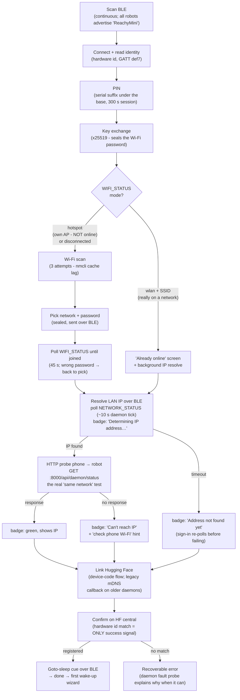

# BLE Setup Flow (current state)

How the first-time setup wizard provisions a Reachy Mini Wireless over
Bluetooth Low Energy: pairing, Wi-Fi join, LAN IP discovery, the
phone→robot reachability probe, and the Hugging Face account link.

This documents the flow **as implemented**. For the original design
study see [`FIRST_TIME_SETUP_PLAN.md`](./FIRST_TIME_SETUP_PLAN.md); for
the scan/dedup internals see
[`BLE_SCAN_ARCHITECTURE.md`](./BLE_SCAN_ARCHITECTURE.md).

Source of truth in code:

| Layer | File |
|---|---|
| FSM + orchestration | `src/features/ble-provisioning/useSetupMachine.ts` |
| Typed BLE protocol | `src/features/ble-provisioning/protocol.ts` |
| Transport + crypto | `src/features/ble/bleWifi.ts` |
| Presentation (one view per phase) | `src/ui/screens/SetupWizardScreen.tsx` |

## Flow diagram

## Key invariants

- **The robot is reached strictly by its LAN IP, read over BLE.** There
  is no mDNS fallback: `reachy-mini.local` is flaky on phone networks,
  and opening an unreachable URL would fake progress. No IP ⇒ the
  sign-in step errors with `robot-ip-unknown` (after one last BLE
  re-poll).
- **`WIFI_STATUS.mode` gates the "already online" fast path.** In AP
  mode the daemon reports `{"mode":"hotspot","connected":"Hotspot"}` -
  `connected` is the robot's *own* access point, not a LAN. Only
  a non-hotspot mode with an SSID counts as already online; hotspot
  routes to the normal Wi-Fi scan. The read is retried up to 3 times:
  right after KEYEX the RESPONSE channel can still hold the previous
  command's payload, which parses to an all-null status without
  throwing - indistinguishable from "not on Wi-Fi". A real answer
  always carries a mode or an SSID; all-null means "read again".
- **`NETWORK_STATUS` (GATT `…def4`) refreshes on a ~10 s daemon tick**,
  so a single read is a coin flip. Every consumer goes through the
  shared `resolveRobotIp` poll loop (1.5 s interval, 12 s budget),
  which drives the wizard's live address badge.
- **Knowing the robot's IP proves nothing about the phone's network**
  (both facts arrive over Bluetooth). The genuine "same network" test
  is the phone→robot HTTP probe (`GET http://<ip>:8000/api/daemon/status`,
  5 s timeout, fire-and-forget). Any HTTP response - even non-2xx -
  proves mutual reachability; only a failed request flags "can't reach".
  The probe is informational: it upgrades the badge but never blocks
  the flow.
- **Central appearance is the only success signal.** OAuth succeeded ⇔
  a robot whose `meta.hardware_id` matches the BLE-read hardware id
  shows up on the HF central listing. Anything else is a recoverable
  `oauth-unconfirmed`, never a fake `done`.
- **The device-code screen leads with the code; the browser is never
  auto-opened.** HF's raw `/oauth/device` response has no
  `verification_uri_complete` (huggingface_hub synthesizes the
  `?user_code=` variant) and the device page asks the user to type the
  code - auto-switching to Safari hid it before they could read it. The
  view shows the code (tap to copy) and a single "Copy code & open
  Hugging Face" action; polling runs regardless, so approving from any
  device completes the wizard.
- **A BLE drop during the sign-in wait is expected, not an error.**
  Opening the Hugging Face page backgrounds the app and iOS then tears
  down the GATT link. By that point BLE has done its job (IP resolved,
  everything else is HTTP + central), so the disconnect watcher ignores
  drops in `device-code-waiting` / `central-waiting` instead of killing
  the poll loop. Only the final goto-sleep BLE cue can be lost, and it
  is best-effort by design.
- **A confirmed connection is remembered (`connectedSsid`).** Set by the
  fast-path detection or a successful join, distinct from `selectedSsid`
  (merely the last row the user tapped). It drives two things: Back from
  the sign-in step returns to the "already online" screen (not a pick
  list the skip path never populated), and the pick list marks the
  robot's current network with a "Connected" row that taps straight
  through to account linking - no password re-entry.
- **Every error carries a `recoverPhase`** so "Try again" bounces the
  user to the right step instead of restarting the whole flow.

## The address badge

The `RobotAddressBadge` (shown on the "Already online" and "Link to
Hugging Face" views) makes the two invisible sign-in preconditions
visible:

| Badge state | Meaning |
|---|---|
| spinner + "Determining IP address…" | BLE poll of `NETWORK_STATUS` in flight |
| spinner + IP | IP found; phone→robot reachability probe in flight |
| green + IP | Phone reached the daemon at that IP - sign-in will work |
| warning + "Can't reach IP" (+ hint) | IP known but the phone couldn't reach it: different network, AP isolation… |
| warning + "Address not found yet" | Poll timed out; sign-in re-polls once more before erroring |
