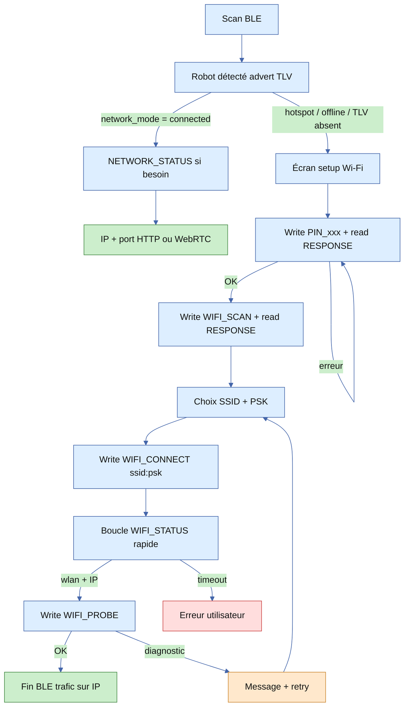
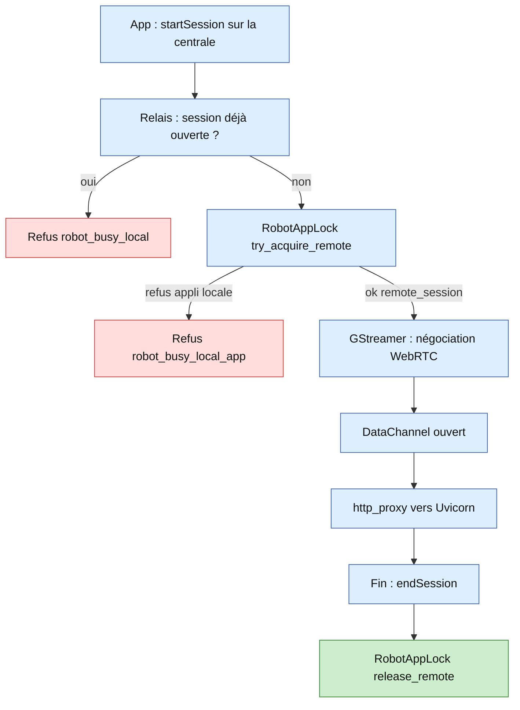
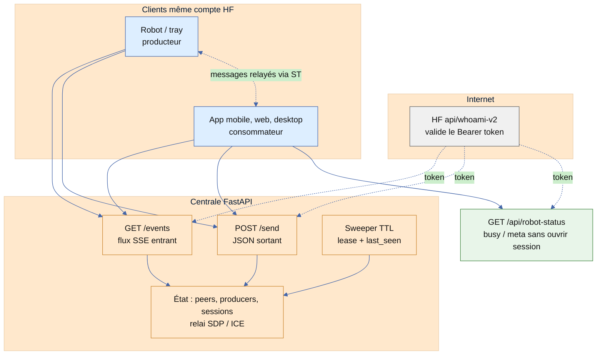

# Connection flow diagrams (draft)

Internal reference: BLE discovery / Wi-Fi setup and remote WebRTC session (including `RobotAppLock`). Edit freely.

---

## 1. Bluetooth – discovery, IP, and Wi-Fi setup (unified)

Single flow: scan → robot seen from the advert (TLV) → either read IP when already on Wi-Fi, or open the provisioning sequence (PIN, scan, connect, probe).



---

## 2. WebRTC – connection sequence (central relay + RobotAppLock)

```mermaid
sequenceDiagram
    autonumber
    participant App as App mobile SDK
    participant Central as Centrale HF
    participant Relay as central_signaling_relay
    participant Lock as RobotAppLock
    participant Gst as GStreamer webrtcbin
    participant API as Uvicorn daemon HTTP

    Note over Relay,Lock: Au boot du daemon : Lock = free, relay enregistré producteur sur la centrale

    App->>Central: startSession peerId robot
    Central->>Relay: startSession + sessionId

    alt Session pending ou active (filet relay)
        Relay->>Central: endSession reason robot_busy_local
        Central-->>App: session refusée ou coupée
    else Pas de session concurrente côté relay
        Relay->>Lock: try_acquire_remote remote
        alt Lock refuse (ex. appli Python locale)
            Lock-->>Relay: false
            Relay->>Central: endSession reason robot_busy_local_app
            Central-->>App: fin de session côté client
        else Lock free → remote_session
            Lock-->>Relay: true
            Relay->>Gst: list puis startSession local
            Gst-->>Relay: session locale, ids mappés central ↔ local

            par SDP et ICE via la centrale
                Gst->>Relay->>Central->>App: offer
                App->>Central->>Relay->>Gst: answer
                App->>Central->>Relay->>Gst: ICE client
                Gst->>Relay->>Central->>App: ICE robot
            end

            Note over App,Gst: ICE connected, DTLS, DataChannel

            App->>Gst: trafic http_proxy sur DataChannel
            Gst->>API: requêtes HTTP vers 127.0.0.1
            API-->>Gst: réponses
            Gst-->>App: réponses encapsulées

            App->>Central: endSession
            Central->>Relay: endSession
            Relay->>Gst: endSession local
            Relay->>Lock: release_remote si plus aucune session
            Lock-->>Lock: état free
        end
    end
```

---

## 3. WebRTC – overview (directed graph, top-down)



---

## 4. Centrale HF – vue lisible (signaling)

Une seule idée : **SSE pour recevoir**, **POST pour envoyer**. Pas de WebSocket dans ce service : tout passe par `/events` + `/send`.



**Ordre typique**

1. Ouvrir **`/events`** → la centrale envoie `welcome` (peerId, lease, heartbeat conseillé) puis la **liste des robots** du user.
2. Trafic temps réel : **`/send`** (`setPeerStatus`, heartbeat, `startSession`, SDP/ICE, `endSession`).
3. **`/api/robot-status`** : lecture seule pour l’UI (occupé, app active, fraîcheur).