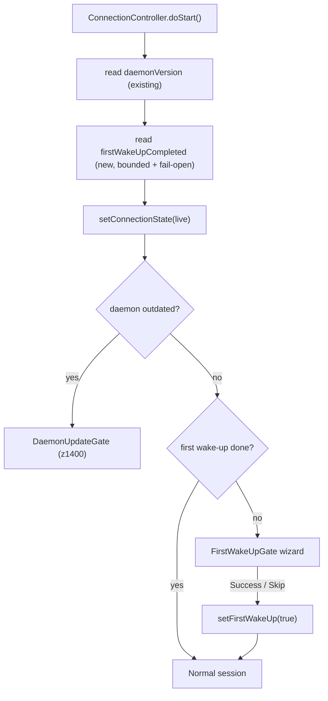

# First Wake-Up Wizard (Mobile, WebRTC) - Plan

> Status: **proposal / draft** · Target: `reachy_mini_mobile_app` (Tauri 2 + React 19 + MUI 9)
> Last updated: 2026-06-17

## 1. Goal

Port the idea of the desktop PR [#225 `feat/first-wake-up`](https://github.com/pollen-robotics/reachy-mini-desktop-app/pull/225)
to the mobile app: a **first-time diagnostic wizard** that runs **right after
connecting** to a Reachy and guides the user through testing the robot's
components, ending with the wake-up. Unlike the desktop app, which drives the
robot over HTTP (`/api/...` on `localhost:8000`), the mobile app reaches the
robot **only through the WebRTC data channel** (central signaling relay), so
everything must go through the **WebRTC JS SDK**.

This is distinct from `FIRST_TIME_SETUP_PLAN.md` (BLE Wi-Fi provisioning, runs
*before* the robot is on the network). The first wake-up wizard runs *after* a
successful session connection.

## 2. Scope (decided)

- **Steps ported:** Welcome, Microphone, Motors, Speaker, Camera, Success.
- **Dropped:** "Sleep Position" check. It relies on the raw joint-state stream
  (`head_joints[7]`, `antennas_position[2]`) from a 20 Hz WebSocket plus a 3D
  viewer and kinematics WASM - none of which is exposed over the mobile WebRTC
  SDK today.
- **Persistence:** the "already completed" flag lives **on the robot**, set/read
  via a **new data-channel command** (mirrors the desktop's `/api/first-wake-up/*`).
  No phone-local storage.

## 3. Current state / hard dependencies

- The mobile app consumes the SDK as a **pinned npm package**
  `@pollen-robotics/reachy-mini-sdk@1.8.0-main.3d52f7d`
  (`reachy_mini_mobile_app/package.json`). Adding a typed SDK method requires
  **publishing a new SDK build and bumping the dependency** - this is the
  critical path.
- The SDK has **no generic event** for unknown data-channel messages
  (`_handleRobotMessage` in `reachy_mini/ts/lib/reachy-mini.ts` is a chain of
  typed `if` branches with silent fall-through). So `sendRaw` alone cannot read
  a response; the round-trip must be added to the SDK (slot pattern).
- The daemon has **no "first wake-up" notion** yet.
- Reusable mobile building blocks already exist: `getMicLevel()` (handle),
  `playSound()` (handle), `attachVideo`/`videoCache` infra (in
  `RobotSession.ts`, not yet wired to UI), `MovePlayer`, `audioLevelMonitor`
  (level in `[0, 1]`).
- Missing from `RobotSessionHandle` and needed by the wizard: `getRobot()`,
  `getVolume()/setVolume()`, `wakeUp()`, and an on-demand mic-level monitor
  (today `getMicLevel()` returns 0 outside an active conversation).

## 4. Target flow

## 5. Work breakdown

### 5.1 Daemon - command + persisted flag
- `reachy_mini/src/reachy_mini/io/protocol.py`: add `GetFirstWakeUpCmd`
  (`type="get_first_wake_up"`) and `SetFirstWakeUpCmd`
  (`type="set_first_wake_up", is_completed: bool`) to the discriminated
  `AnyCommand`.
- `reachy_mini/src/reachy_mini/daemon/backend/abstract.py` `process_command()`
  (next to `GetVersionCmd`): handler that reads/writes the flag and replies
  `{"command":"get_first_wake_up","is_completed": bool}`.
- Persistence: a small JSON on the robot (e.g.
  `~/.config/reachy_mini/first_wake_up.json`). No generic daemon prefs file
  exists to reuse, so create one (read at boot, write on `set`).

### 5.2 SDK TS - `getFirstWakeUp` / `setFirstWakeUp`
- `reachy_mini/ts/lib/reachy-mini.ts`: add
  `getFirstWakeUp(): Promise<boolean | null>` and
  `setFirstWakeUp(done: boolean): Promise<boolean | null>` via the existing
  `_slotRoundtrip` helper, plus a branch in `_handleRobotMessage`
  (`data.command === 'get_first_wake_up' | 'set_first_wake_up'`).
- Publish the SDK, bump `@pollen-robotics/reachy-mini-sdk` in
  `reachy_mini_mobile_app/package.json`, and extend the engine-facing interface
  in `reachy_mini_mobile_app/src/features/robot-session/sdk-types.ts`.

### 5.3 Mobile - session plumbing (no-flicker, capabilities)
- Mirror the existing `daemonVersion` bring-up pattern: resolve
  `firstWakeUpCompleted` as the **last bring-up step, before `live`**, so the
  gate decides synchronously (no flicker).
  - `src/features/conversation/engine/connection-controller.ts`:
    `readFirstWakeUpDuringBringUp()` (bounded + **fail-open**: `null` /
    unsupported daemon => treat as "completed" so we never trap users on an old
    daemon) + `emitFirstWakeUpStatus`.
  - `src/features/conversation/engine/types.ts` +
    `src/features/conversation/engine/conversation-engine.ts`: add an
    `onFirstWakeUpStatusChange` observer.
  - `src/features/robot-session/useRobotSession.ts`: expose
    `firstWakeUpCompleted: boolean | null` and `setFirstWakeUp(done)` on
    `RobotSessionHandle`; reset on teardown.
- Widen the capability surface for the wizard (absent from the handle today):
  `wakeUp()`, `getVolume()/setVolume()`, `attachVideo(el)` (infra ready in
  `src/features/robot-session/RobotSession.ts`), and an on-demand mic-level
  monitor (see `src/features/conversation/engine/audio-monitors-control.ts`).
  Simplest option: expose `getRobot()` on the handle (already on
  `RobotSession`).

### 5.4 Mobile - wizard UI
- New folder `src/ui/screens/session/first-wake-up/` with `FirstWakeUpGate.tsx`
  (full-screen overlay, same mould as
  `src/ui/screens/session/DaemonUpdateGate.tsx`) plus steps: `WelcomeStep`,
  `MicrophoneStep` (bars via `getMicLevel`), `MotorStep` (`wakeUp()` + "did it
  move?"), `SpeakerStep` (`playSound` + volume slider), `CameraStep` (`<video>`
  + `attachVideo`), `SuccessStep`.
- Mount in `src/ui/screens/RobotSessionScreen.tsx` next to `DaemonUpdateGate`,
  z-index below the update gate, visible only when
  `!outdated && firstWakeUpCompleted === false`.
- Motion transitions + progress bar consistent with the existing
  `SetupWizardScreen`; reuse the desktop-branch illustrations
  (`reachy-camera.svg`, `reachy-microphone.svg`, `reachy-fiesta.svg`) plus the
  existing `reachy-speaker.svg`.
- "Skip setup" button (like desktop) that still runs `wakeUp()` then
  `setFirstWakeUp(true)`.

### 5.5 Verification
- `tsc --noEmit` + lint (mobile); SDK build; daemon tests if present.
- Manual: old daemon without the command => wizard skipped (fail-open); daemon
  with `is_completed=false` => wizard shows with no flicker; each step;
  completion => flag written + normal session; reconnect => no wizard.

## 6. Risks / notes

- **Critical path** = SDK npm republish + bump (5.2). Without it the mobile app
  cannot read/write the flag (no generic DC event to work around it via
  `sendRaw`).
- The wizard runs before conversation auto-start, so the mic-level monitor must
  be enabled on demand for the Microphone step.
- Gate ordering: an outdated robot sees the update gate first, the first wake-up
  wizard second.
